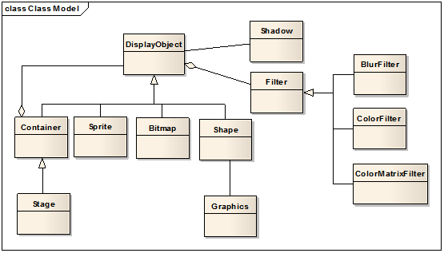
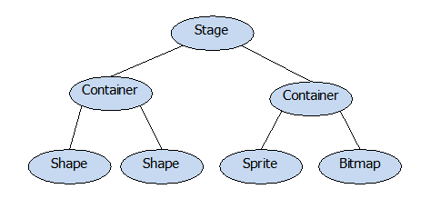

### EaselJS

#### 说明

在学习的过程中对 [EaselJS API doc](http://createjs.com/docs/easeljs/modules/EaselJS.html) 
进行整理，方便其他初学者，也方便查阅。

#### EaselJS 类的结构：

> 我们把上图所有的类都称作「元件」

上图列出了 createjs 的主要类结构，如图可以得到如下信息：

1. 所有元件的基类都是 DisplayObject，所有元件都是一个构造函数（类）
2. Container 可以包含其他（任何）元件。由于它本身也是一个元件，所以不同的 Container 之间可以相互包含
3. 舞台 Stage 是一个特殊的 Container ，也是一个 DisplayObject，它内部封装了 canvas 对象
4. Sprite 元件用来表现帧动画（类似 gif）
5. Bitmap 元件用来表现纯静态的图片
6. Shape 元件用来表现矢量图形，它的实例包含一个 Graphics 元件，用来描述图形
7. Filter 和 Shadow 则是滤镜分支，可以针对任意元件实现颜色变换、模糊、阴影等效果。
使用滤镜的方式跟 Flash 一致，需要新建 Filter 实例，添加到目标元件的 FilterList 中，Createjs 框架在下一帧就会把该元件加上滤镜效果
8. 另外图中没有画的元件还有：Text 元件用来表现文本、DOMElement 元件用来控制 HTML DOM 元素

在一个应用中，各个元件类的实例之间的关系类似下面这张图：

每个类都有各自的静态方法，如：`createjs.Ticker.setFPS(20)` ，同时也可以用来初始化一个对象，如：`new createjs.Stage('myCanvas')`

参考：
1. [博客园 kenkofox 的文章](http://www.cnblogs.com/kenkofox/p/4153853.html)
2. [API doc](http://www.createjs.com/docs/easeljs)

#### EaselJS 提供的类

我们分别在其他文件中具体说明：

> 如果是第一次看，请按照顺序依次阅读，因为前面的知识后面不会再解释，只会进行补充。

##### 已完成

> 靠前的文中涉及到的知识，后面的文只要大概说明并做补充即可（可以附上前文的链接）。
> 如果发现前文说法有问题或不充分，请实时更改。

* [基础教程](./learning.md)

* [Bitmap](./Bitmap.md)

##### 未完成

> 期待你的加入 ∩_∩

> 请按重要性进行总结（开发常用的、直接使用(非继承)的 优先，重要的基类优先）

已排序

未排序

* [EaselJS]()

* [DisplayObject]()

* [Container]()

* [AlphaMapFilter]()
* [AlphaMaskFilter]()
* [BitmapText]()
* [BlurFilter]()
* [ButtonHelper]()
* [ColorFilter]()
* [ColorMatrix]()
* [ColorMatrixFilter]()
* [DisplayProps]()
* [DOMElement]()

* [Filter]()

* [Shadow]()

* [Graphics]()
* [Graphics.Arc]()
* [Graphics.ArcTo]()
* [Graphics.BeginPath]()
* [Graphics.BezierCurveTo]()
* [Graphics.Circle]()
* [Graphics.ClosePath]()
* [Graphics.Ellipse]()
* [Graphics.Fill]()
* [Graphics.LineTo]()
* [Graphics.MoveTo]()
* [Graphics.PolyStar]()
* [Graphics.QuadraticCurveTo]()
* [Graphics.Rect]()
* [Graphics.RoundRect]()
* [Graphics.Stroke]()
* [Graphics.StrokeDash]()
* [Graphics.StrokeStyle]()

* [Matrix2D]()

* [MouseEvent]()

* [MovieClip]()
* [MovieClipPlugin]()

* [Point]()

* [Rectangle]()

* [Shape]()

* [Sprite]()
* [SpriteContainer]()
* [SpriteSheet]()
* [SpriteSheetBuilder]()
* [SpriteSheetUtils]()
* [SpriteStage]()

* [Stage]()

* [Text]()

* [Touch]()

* [UID]()
* [Utility Method]()

#### 解读

#### 游戏 & 特效
