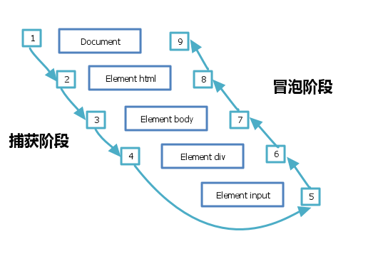

## CreateJs 学习总结 —— EaselJS

### 须知

本文主要是根据 createjs 中的 EaselJS 在 github 上的 tutorials 目录下的文章整理而来 （[原文链接](https://github.com/CreateJS/EaselJS/tree/master/tutorials)），同时也包含了很多本人的理解，如过有叙述不当的地方，请联系我 :-D 

本文对原文中的一些知识点的解释进行了删减，对另外一些进行了扩展，同时对文中的 demo 进行了改写，如果感到阅读困难的话请参考原文（本文中有对应的原文链接）

如果文中提供的 demo 无法打开，可以直接查看原文中的 demo。

### 从一个简单例子开始

对应原文：[Getting Started](http://www.createjs.com/tutorials/Getting%20Started/)

#### EaselJS 类的结构：


> 我们把上图所有的类都称作「元件」

上图列出了 createjs 的主要类结构，如图可以得到如下信息：

1. 所有元件的基类都是 DisplayObject，所有元件都是一个构造函数（类）
2. Container 可以包含其他（任何）元件。由于它本身也是一个元件，所以不同的 Container 之间可以相互包含
3. 舞台 Stage 是一个特殊的 Container ，也是一个 DisplayObject，它内部封装了 canvas 对象
4. Sprite 元件用来表现帧动画（类似 gif）
5. Bitmap 元件用来表现纯静态的图片
6. Shape 元件用来表现矢量图形，它的实例包含一个 Graphics 元件，用来描述图形
7. Filter 和 Shadow 则是滤镜分支，可以针对任意元件实现颜色变换、模糊、阴影等效果。
使用滤镜的方式跟 Flash 一致，需要新建 Filter 实例，添加到目标元件的 FilterList 中，Createjs 框架在下一帧就会把该元件加上滤镜效果
8. 另外图中没有画的元件还有：Text 元件用来表现文本、DOMElement 元件用来控制 HTML DOM 元素

在一个应用中，各个元件类的实例之间的关系类似下面这张图：


每个类都有各自的静态方法，如：`createjs.Ticker.setFPS(20)` ，同时也可以用来初始化一个对象，如：`new createjs.Stage('myCanvas')`

参考：

1. [博客园 kenkofox 的文章](http://www.cnblogs.com/kenkofox/p/4153853.html)
2. [API doc](http://www.createjs.com/docs/easeljs)

#### Container 容器

> 如果不太好理解，可以先大概看一看，对阅读后面的部分没有影响

首先所有可以绘制到画布上的对象（图形、图片等）都称作「显示对象」，而「容器」可以容纳一个显示对象列表。

例如你可以将头、四肢、躯干 3 个显示对象容纳到一个 person 容器中，通过：

```
//var head = .., body = .., arm = ..

//实例化一个容器对象
var person = new createjs.Container();

//将显示对象放入容器中
person.addChild(head, body, arm);
```

这样你可以将 person 对象作为一个整体进行图形变换，也可以单独的将每一部分进行图形变换。即人可以整体向前移动，而他的头部也可以同时左右摆动。

#### Stage 舞台

舞台（Stage）对象指向我们的 canvas 元素 ，它是一个特殊的 Container 对象，它包含了所有我们希望绘制到 canvas 上的图形/图片，即 任何一个希望展示在画布上的图形/图片都必须包含在 Stage 对象中。

例如一个图形 s1 希望绘制到 canvas 上，则必须先  `stage.addChild(s1)`

Stage 对象的实例化过程入下：

```
<canvas id=canvasId width=400 height=400></canvas>

//... balabala ...

//参数为 canvas id 或者 canvas DOMElement
var stage = new createjs.Stage('canvasId');
```

#### Shape

shape 对象帮助我们在 canvas 上绘制矢量图形（vector graphics）

> 注：canvas 绘制的图形都是位图，createjs 应该是通过计算绘制出类似矢量图的效果

shape 对象有一个 graphics 属性，它指向一个 Graphics 实例，它拥有所有有关定义矢量图形的方法。

所有「显示对象」（可以在画布上看到的对象，类似 shape 矢量图形），都拥有统一的 位置 和 图形变换 属性，如 x y（位置属性）、rotation（旋转属性）、scaleX scaleY（缩放属性）等。

绘制一个红色的圆形，如下：

```
var circle = new createjs.Shape();

//红色的半径为50的圆形，它位于(0, 0)点坐标
// - 注意：(0, 0)点是相对于 circle 对象来说的，是相对坐标
circle.graphics.beginFill("red").drawCircle(0, 0, 50);

//所有「显示对象」通用的「位置」属性
circle.x = 100;
circle.y = 100;

//只有添加到 stage 舞台之后，才可以显示
stage.addChild(circle);//返回值为 circle 本身

```

以上代码也可以简写如下：

```
stage.addChild(new createjs.Shape()).set({x: 100, y: 100}).graphics.f('red').dc(0, 0, 50);
```

#### update

虽然我们已经将 circle 矢量图添加到 stage 的显示列表中了，但只有我们在 update 之后才会绘制到 canvas 上。

```
stage.update();
```

update 函数会先将画布清空（通过 clearRect ），然后执行 stage 中所有 children 的绘制方法，最终将他们绘制在画布上。

最终的 [DEMO](https://jsfiddle.net/tianyn1990/hyqnp9ao/)


### 动画 & Ticker

对应原文：[Animation and Ticker](http://www.createjs.com/tutorials/Animation%20and%20Ticker/)

#### 动画基础

> canvas 2d 的原生基本动画实现请参考另一篇文章的第一部分：[canvas 学习总结](https://note.youdao.com/groupshare/?token=1B984AAC61FC40ADA77FF0501C839F27&gid=12651257)

除了直接使用 setTimeout、requestAnimationFrame 等方法，以某个固定间隔循环以实现动画效果之外，createjs 还提供了 Ticker 类用来更方便实现动画效果。

使用 Ticker ，你可以暂停，或修改循环频率。还可以有选择的使用 setTimeout 或 requestAnimationFrame。

Ticker 是 createjs 上的静态接口，不需要 new instance。

默认帧率为 20FPS。有 3 种修改方法：

```
//方法一：
createjs.Ticker.setFPS(40);

//方法二：
createjs.Ticker.framerate = 40;

//方法三：单位 ms，（修改的是时间间隔 regular interval）
// - 25ms 与前两个方法等价，因为：1000ms / 25ms = 40fps
createjs.Ticker.interval = 25;
```

基本使用：

```
// on 也可以改成 addEventListener。用来监听 tick 事件（最终绑定在 window 对象上）
createjs.Ticker.on('tick', function(event){
    circle.x += 5;
    stage.update(event);
});
```

参考：[DEMO](https://jsfiddle.net/tianyn1990/gurd0sc1/);


#### 基于时间的动画（而非刷新频率）

##### 问题

> 请耐心看完 :z

使用 requestAnimationFrame 的动画都存在一个问题，当运行在性能较差的设备上的时候，浏览器的刷新频率会降低。

如果动画的位移是根据频率计算的。也就是说：我们是根据频率（假设为 60fps）计算的每一次循环的时间间隔，假设为 1000 / 60 = 16.667 毫秒，即一次循环时间间隔为  16.667 毫秒，
然后可以通过这个时间得出对应的位移量：

假设我们希望小球 1秒 位移 500px，那么 16.667ms 需要位移 500/60 = 8.333px，由此计算出位移量为 8.333px。

那么当浏览器的刷新频率降低，我们预期的 60fps 没有达到，可能变为 40fps ，那么每次循环时间间隔变为 1000 / 40 = 25ms，
因为我们设置的每次循环的位移量还是 8.333px，那么 1s 的位移量就变为了 333.333px，其结果就是在看起来小球的移动速度降低了。

另外，在代码中动态修改设置的 FPS 值的时候，所有的位移值都需要重新计算，也会遇到上述问题。

##### 解决

Ticker 可以将动画与帧率解耦，通过保证动画的执行是基于时间（而非频率），
来实现动态的改变FPS（无论是因为设备性能差，还是代码中进行了修改）时不会影响动画的速率。

也就是说，「位移量」取决于时间，而不是变来变去的帧率。当帧率下降的时候，每次循环中的位移量会相应变大。

它的实现方式很简单：  
在 tick 事件的回调函数的中增加参数 delta。
delta 的值是上一次触发 tick 事件到现在（两次 tick 事件之间）的时间间隔。如果代码运行在一个性能很差的设备上时，delta 的值将明显比预期的 1000/FPS 大。
我们可以根据 delta 来计算当前 tick 的位移。

```
var fps = 60;
createjs.Ticker.setFPS(fps);

createjs.Ticker.on('tick', function (evt) {
    // 为方便计算，循环体中的所有位移，均认为是 1s 中的位移，只要乘以 delta 参数，即可得到真正的位移
    //  - 「真实时间」相对于 1000ms 「缩放」的倍数
    evt.delta = evt.delta / 1000;

    // 500 表示位移速度为：500px/s，所有的位移均乘以 delta 缩放倍数，换算成「真实时间」的位移
    circle.x += 500 * evt.delta;

    //...其他代码

    stage.update(evt);
});
```

参考：[DEMO](https://jsfiddle.net/tianyn1990/2qj131mu/)，在例子中，切换帧率不影响小球的运动速率

> 注意：必须在 update 的时候将 evt 作为参数传入 `stage.update(evt);`，才能正确的获取 evt.delta 值 

另外 Ticker 还会暴露一个 getTime 方法，可以获取到从 Ticker 初始化（监听 tick 事件开始）到现在的总时间。

```
createjs.Ticker.getTime();
```

同时，使用精灵图实现 gif 图片效果的时候，也可以使用基于时间的动画。涉及API：Sprite、SpriteSheet等。

#### TIMING MODE

较新的浏览器都开始支持 requestAnimationFrame， 它能带来很多好处，包括动画的平滑运行、减少 CPU 和电量的消耗等。
然而 createjs 默认不启用它，而是使用 setTimeout。

我们可以通过 `Ticker.timingMode` 来启用 requestAnimationFrame。

它的默认值为 Ticker.TIMEOUT 从而使用的 setTimeout ，它兼容所有浏览器，并提供了可预期的、灵活的帧率（见上一小节），
然而抛弃了 requestAnimationFrame 的各种好处。不过你可以通过减少帧率来降低 CPU/GPU 的消耗。

有两种模式可以启用 requestAnimationFrame，它们都会在浏览器不支持 requestAnimationFrame 的时候，自动回退到 setTimeout：

1. `Ticker.RAF` 模式会单纯的使用 RAF ，忽略掉设置的帧速率等值（3种设置帧率的方式全部失效）。  
因为 RAF 的频率是不确定的（由浏览器和当前运行环境决定）。如果使用了这种模式，建议一定要使用前面提到的「基于时间的动画」来确保动画速率的一致。

2. `Ticker.RAF_SYNCHED` 模式试图协调 RAF 和你设置的帧率，这种方式结合了 setTimeout 和 RAF 的优点，
但会在帧周期中造成极大的差异（*无法理解原文的含义*），因此这种模式在帧率为 60 的因子时运行的最好，如：10、12、15、30、60。

```
createjs.Ticker.timingMode = createjs.Ticker.RAF_SYNCHED;
createjs.Ticker.framerate = 30;
```

#### 暂停

所有的 Ticker 都是可以暂停的，如果设置

```
Ticker.paused = true;
//或者
createjs.Ticker.setPaused(true);
```

那么 `createjs.Ticker.getPaused()` 的返回值为 true，在循环 tick 中，我们可以通过这个返回值判断需要跳过执行的代码：

```
function tick (evt){
    if(!createjs.Ticker.getPaused()){
        //...这段代码当 paused 的时候不会执行
    }
    stage.update(evt);
}
```

另外，`createjs.Ticker.getTime(true)` 返回除去暂停的时间的真正运行的总时长。

参考：[DEMO](https://jsfiddle.net/tianyn1990/h1es7Ljf/)

#### Tick

当调用 `stage.update(event)` 方法的时候，每一个 stage 的 children 都会触发它本身暴露的 tick 事件。

通过这些 children 的 tick 事件，我们可以灵活的处理每一个显示对象，且上下文为它本身：

```
//原来的写法
createjs.Ticker.on('tick', function (evt) {
    circle.x += 5;
    stage.update(evt);
});

//现在可以写成
createjs.Ticker.on('tick', function (evt) {
    stage.update(evt); //会触发 circle 的 'tick' 事件
});
circle.on('tick', function(){ this.x += 5 }); //上下文为 circle
```

#### 性能

> 注意高的帧率不一定意味着更好的流畅度，较低的帧率会减少 CPU/GPU 的使用，并提供始终如一的体验。
> 请为你的项目选择一个适合的帧率。

可以通过 `createjs.Ticker.getMeasuredFPS()` 获取到过去一秒钟的平均帧率。  
或者通过 `createjs.Ticker.getMeasuredTickTime()` 获取到过去一秒钟，每一次 tick 循环的平均时间

如果 `getMeasuredFPS` 接近设定的 FPS 值，说明性能良好。

`getMeasuredTickTime` 的值表示一次循环中，执行动画函数消耗的时间，
比 `1000 / fps` 越小，说明在一次循环中有更多的时间冗余，剩余更充足的时间提供给浏览器进行渲染等其他工作。

参考：[DEMO](https://jsfiddle.net/tianyn1990/nyxpkdpw/)

#### TWEENJS

通过缓动函数创建动画或动画序列。

```
createjs.Tween.get(txt).to({x:300}, 1000).to({x:0}, 0).call(onAnimationCompleteFn);
```

### 文本

#### 有关字体的一点知识

如果浏览器无法再本机中找到 css 要求的字体，那么会自动匹配类似的字体（主要是英文），如下：

serif，衬线体，在字的主要线条后面会有一个小尾巴，常见：Georgia、Times、Times New Roman

sans-serif，无衬线体，没有小尾巴更清爽，常见：Arial、Verdana、Helvetica

monospace，等宽字体，顾名思义（反义：non-monospace），常见：Courier、Courier New

cursive，手写体，例如：Comic Sans、Monotype Corsiva

fantasy，装饰用的字体，常用来表示标题等少量文本，不适宜文章主体使用，例如：Impact、Haettenschweiler


#### 展示文本

```
var text = new createjs.Text("Hello World", "bold 86px Arial", "#ff7700");
```

或者：

```
var text = new createjs.Text();
text.text = "Hello World!";
text.font = "bold 96px Dorsa";
text.color = "#000000";
```

其他的参数还有：（与 canvas 2d 中 context 关于文本的属性含义相同）
```
text.lineHeight = 15;
text.textAlign = 'center';
text.textBaseline = 'top';
```

初始化的第二个参数，跟 css 中 font 的格式完全一致。

另外如果要显示在画布上，不要忘记写：

```
stage.addChild(text);
stage.update();
```

还是上一个[DEMO](https://jsfiddle.net/tianyn1990/nyxpkdpw/)


### 继承

对应原文：[Inheritance](http://www.createjs.com/tutorials/Inheritance/)

我们可以继承已有的「显示对象」，创建新的自定义类。实现方法有很多种，下面介绍其中之一。

举例：实现一个继承于 Container 类的自定义类 Button：

共分 4 步：

1. 自定义构造器
2. 继承父类，获得父类的功能
3. 重写已有方法，扩展自身方法
4. promote 继承来的方法，返回自定义类 

```
(function () {
    // 自定义构造器
    //  - 调用继承的父类构造器（）
    //  - label 为自定义入参
    var Button = function (label) {
      this.Container_constructor();
      this.label = label;
    };

    // 继承 Container 类
    //  - 将 Container 添加到 Button 的调用链上，赋予 Button 所有 Container 的方法
    //  - 返回值为 Button.prototype
    var p = createjs.extend(Button, createjs.Container);

    // 重写 draw 方法
    //  - 首先调用父类的 draw 方法
    p.draw = function () {
      this.Container_draw();
      // 添加自定义逻辑
    };

    // 将父类 Container 的所有方法（包括 constructor）都重写添加到 Button
    //  - 例如上文用到的：Container_constructor、Container_draw
    //  - 新方法命名规则：prefix_methodName，prefix 为参数 "Container"
    window.Button = createjs.promote(Button, "Container");
  })();
```

`createjs.promote` 跟 `createjs.extend` 是不同的。上面代码的逻辑是：

1. 首先通过 extend，赋予 Button 所有 Container 的方法（只是放在调用链 Button.prototype 上）；
2. 再通过 promote，将调用链上的方法 提升（promote） 到 Button 对象上，并修改了方法名，防止命名冲突，便于记忆。

原文中的 [DEMO](http://www.createjs.com/tutorials/Inheritance/demo.html)，[源码](https://github.com/CreateJS/EaselJS/tree/master/tutorials/Inheritance)


### 命中测试

对应原文：[HITTEST](http://www.createjs.com/tutorials/HitTest/)

#### hitTest & globalToLocal

显示对象拥有函数 `hitTest` ，用来检测一个点是否在该显示对象中间。我们可以通过它来检测指针（鼠标/手指点按）是否在一个图形中。

```
circle.hitTest(stage.mouseX, stage.mouseY);
```

上面的写法检测指针当前的位置（stage.mouseX, stage.mouseY）是否在 circle 圆形中，但存在一个问题。

无论 createjs.Stage 类，还是 createjs.Shape 类，都继承于 createjs.Container 类。
他们都是一个容器，都拥有 `addChild` 方法，因此可以互相嵌套。并且他们都位于「各自的坐标系」中。
其中 stage 的坐标系我们可以称为 global（世界坐标系），而其他的容器对象如 cirlce 的坐标系我们称为 local。

circle.hitTest 的参数当然需要基于 circle 的坐标系，而 stage.mouseX 获得的点的坐标系是基于 global 的。

因此我们需要通过 `circle.globalToLocal(stage.mouseX, stage.mouseY)`（返回值为：{x, y} 对象），
来将 global 坐标系的坐标转换为 circle 坐标系的坐标。

参考：[DEMO](https://jsfiddle.net/tianyn1990/57fepbua/)、[DEMO2](https://jsfiddle.net/tianyn1990/55jqgno9/)

从 DEMO2 可以看出 globalToLocal 方法会将目标对象的父元素的「图形变换」的因素都考虑在内。
如果有多级元素嵌套，我们仍可以使用该方法将 global 坐标转换为内层子元素的 local 坐标。

#### localToLocal

除了检测指针相对于图形的位置，我们还可以检测一个显示对象相对于另一个显示对象的位置。

`objA.localToLocal(posX, posY, objB)` 方法，可以将 objA 对象的 local 坐标系中的点（posX, posY），
映射到 objB 对象的 local 坐标系中。返回值仍然为 {x:, y:}。

> 注意：（posX, posY）坐标是从 objA 映射到 objB，`source.localToLocal(x, y, target)`

参考：[DEMO](https://jsfiddle.net/tianyn1990/fhnuwsyd/)


### 鼠标交互

对应原文：[Getting Started](http://www.createjs.com/tutorials/Mouse%20Interaction/)

#### 基础

鼠标交互，就是监听鼠标/手指等的交互事件。「显示对象」通过使用 addEventListener 即可监听事件。比如 click 事件：

```
circle.addEventListener('click', function () { alert('circle clicked') });
```

可以监听的事件有：  
click, dblclick,  
mousedown, pressmove, pressup,    
mouseover / mouseout, and rollover / rollout.

其中最后 4 个（mouseover / mouseout, rollover / rollout）是有一定关联的，它们默认不启用，使用的时候需要：

```
stage.enableMouseOver(frequency);
```

其中 frequency 是指在一秒内检查（计算）多少次事件是否触发。默认值为 20 次/秒。
设置的值越高，相应速度越快，但相应的需要更多的计算量。

> 这样做的好处是使 检查的频率 与 设置的帧率 解耦。

有几点需要注意：

1. 没有 mouseup 和 pressdown 事件。可以把 mousedown、pressmove、pressup 分成一组。

2. pressup 与 click 事件的区别是，click 事件在同一点按下与抬起时触发，而 pressup 会在任意一处拿起时都会触发。

3. on 方法可以用来替代 addEventListener，并且 on 方法还额外提供了一些参数：

```
circle.on(type, listener, scope, once, data, useCapture);
```

监听事件的回调函数 listener 的参数是一个 EaselJS 定义的 MouseEvent 对象，它包含一些有用的属性：

1. type：事件类型（'mousedown'、'pressmove'、'pressup' 等）
2. target：触发事件的显示对象
3. nativeEvent：基于的原生事件对象
4. stageX、stageY：触发事件的点在 global 坐标系的坐标
5. 还有一些不常用的属性，可参考 API

参考：[DEMO](https://jsfiddle.net/tianyn1990/gnhd7pbt/)

通过上面的 DEMO，当多个事件同时触发时（更换绑定顺序结果不变）：

1. 先触发 click 再触发 pressup
2. 先 rollover 再 mouseover
3. 先 mouseout 再 rollout

#### 对性能的好处

事件 mouseover / mouseout, rollover / rollout 也可以通过对检查频率的设置，来优化性能。
要知道小于 100ms 的响应时间用户是几乎不会感知到的，而它只需要 10fps，相对于 60fps 的动画来说性能提升了 6 倍。

而其他的事件 click, dblclick, mousedown, pressmove, pressup，
我们可以通过监听原生事件，在「对应的原生事件」触发的时候才调用回调，而不是放到 tick 循环中，因此可以提升性能。

#### 事件冒泡

对于 DOM 节点来说，当一个事件被触发之后，会经过 3 个阶段：捕获阶段、目标阶段、冒泡阶段



参考文章：[事件阶段](https://segmentfault.com/a/1190000004463384)、
[MDN 文章中有一个很直观的demo](https://developer.mozilla.org/en-US/docs/Web/API/Event/eventPhase)

> 补充：当事件进行到目标阶段时，目标阶段上注册的捕获事件和冒泡事件的触发顺序是由注册顺序决定的（addEventListener 代码的执行顺序）

注册捕获事件需要使用 `addEventListener(type, listener, useCapture)` 的第三个参数 useCapture 设置为 true，

跟在 DOM 上绑定事件一样，createjs 也对事件的触发有着相似的处理方法。

由于是对虚拟的 js 对象（而非 DOM 结构）进行事件的绑定，因此它内部的处理方式是 createjs 仿照 DOM 的机制实现的一套逻辑。
跟 DOM 事件没有必然联系。其本质上都是 canvas 元素触发了事件之后，再由 createjs 进行处理。

createjs 中的 on 方法也有 useCapture 参数用来注册捕获事件：`circle.on(type, listener, scope, once, data, useCapture)`

我们先明确一下名词的定义（以 click 事件为例）：

1. target：触发事件的节点中最内层的节点。比如点击有多个节点重合（父节点子节点都有），那么最内层的子节点就是 target。
2. currentTarget：事件流转到的当前节点。

createjs 中的对象/容器处理事件也经过 3 个同样的阶段：

1. 捕获阶段：  
首先触发 stage 的捕获事件（stage 上绑定的 useCapture == true 的事件），然后依次触发 target 的最外层祖先容器到最内层父容器的捕获事件
2. 目标阶段：  
target 对象触发自身的事件（包括所有捕获事件和冒泡事件）
3. 冒泡阶段：  
与捕获阶段相反，依次触发 target 的最内层父容器到最外层祖先容器，直到 stage 对象的冒泡事件（useCapture == false 默认值）

这个 [DEMO](https://jsfiddle.net/tianyn1990/o2vcvpwx/) 中所有容器与显示对象都注册了 click 事件（包括 useCapture 值为 true 和 false 两种），
其中 button 对象是一个 Container 容器对象，它包含两个显示对象：background、label。你可以通过点击「红色背景」和「白色文字」来分别查看对应「事件阶段」结果。

另外还有两个属性用来控制捕获&冒泡：

1. `mouseChildren` 可用来将一个显示对象集合作为一个事件整体，如上面的 DEMO 中，设置 `button.mouseChildren = false;` 那么 button 这个容器
所包含的所有子显示对象的事件将不会触发，整个 button 集合将作为整体对事件进行相应。

2. `mouseEnabled` 顾名思义，可以用来禁止一个对象的所有事件。需要注意的是，如果 button 这个集合设置了 `button.mouseEnabled = false;` 
那么它的所有子显示对象的事件将都不会再被触发了。

#### HITAREA

前文介绍了鼠标交互的各种事件，但可以被触发事件的只有显示对象的「可见 且 不透明 」的像素点。
在上面[事件阶段的 DEMO ](https://jsfiddle.net/tianyn1990/o2vcvpwx/)中，可以发现 label （按钮的文字）上注册的事件想要被触发，
必须精确的点击到「文字的线条」上。

createjs 提供了 `hitArea` 。你可以设置另一个对象 objB 作为显示对象 objA 的 hitArea，当点击到 objB 时就相当于点击到了 objA。
这个 objB 不需要添加到显示对象列表，也不需要可见，但它会在交互事件的触发中替代 objA。

> 注意：`hitTest` 命中检测并不适用于 `hitArea`，命中检测还是针对显示对象的「可见且不透明」的像素点（不然命中检测的逻辑就显得混乱了）。
> `hitArea` 只针对交互事件的触发。如果真的有这种需求，可以非常简单的自己实现。

参考：[DEMO](https://jsfiddle.net/tianyn1990/puf7udm5/)

上面的 demo 中，container 对象为所有蓝色的圆形的整体，它的 hitArea 是红色的圆形，
当指针 mouseover 红色的圆形时，container 的 mouseover 事件会被触发。

#### stage 对象的交互事件

> 在 EaselJS 0.5 版本之前，stage 对象是无法绑定交互事件的，后来有人提了 [ISSUES](https://github.com/CreateJS/EaselJS/issues/241)，在之后的版本中解决掉了这个问题。

一般的显示对象监听事件触发的范围为「可见且不透明」的像素点，而 stage 对象显然不同。

stage 对象有它特殊的交互事件：stagemousedown, stagemouseup, stagemousemove，整个 canvas 都对它们生效。

> 注：stage 对象还可以监听 click、mouseleave、mouseenter，后两者可以监听指针进入/离开 canvas。

当指针离开 canvas 范围之后 stagemousemove 事件就不会触发了，如果希望在画布之外继续触发事件，需要设置： `stage.mouseMoveOutside = true;` 。
之后当离开画布范围后，stage 的 3 个特殊事件都会继续被监听。

`evt.stageX`, `evt.stageY` 不会超出画布的边界范围（大于 0 小于 width/height），如果希望获取到外界的坐标，可以使用 `evt.rawX`, `evt.rawY`。

```
//超出画布之后仍允许监听 stage 的各种事件
stage.mouseMoveOutside = true;

stage.on("stagemousemove", function(evt) {
    //永远在边界以内
    console.log("stageX/Y: "+evt.stageX+","+evt.stageY);
    
    //可以超出边界，小于 0 或 大于 canvas 的宽高（CW/CH）
    console.log("rawX/Y: "+evt.rawX+","+evt.rawY);
});
```

我们可以通过 `stage.mouseInBounds` （参考之前[ hitTest 的这个 DEMO ](https://jsfiddle.net/tianyn1990/55jqgno9/)有用到）来判断指针是否离开 canvas 范围。
或者监听 stage 的事件：`mouseleave`, `mouseenter` 来判断。

参考：[DEMO](https://jsfiddle.net/tianyn1990/Lekecxdb/)

#### 拖拽

通过对前面介绍过的一些事件的监听，我们可以非常方便的实现拖拽效果。主要是使用 mousedown, pressmove, pressup 这一组事件。

直接看 [DEMO](https://jsfiddle.net/tianyn1990/d5ntmvjf/)

#### 其它常用 API

1. `Container.getObjectUnderPoint(x, y, mode)` ，参考[ API doc ](http://www.createjs.com/docs/easeljs/classes/Container.html#method_getObjectUnderPoint)
2. `Container.getObjectsUnderPoint(x, y[, mode = 0])` ，参考[ API doc ](http://www.createjs.com/docs/easeljs/classes/Container.html#method_getObjectsUnderPoint)
3. `DisplayObject.hitTest(x, y)`，本文前面的「命中测试」部分介绍过
4. ...请阅读[ API doc ](http://www.createjs.com/docs/easeljs)

